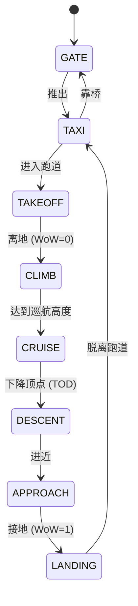

# ADIF Simulator 软件详细设计说明书

**版本**: 1.1
**日期**: 2025-12-31
**状态**: 正式发布

---

## 1. 引言 (Introduction)

### 1.1 编写目的
本文档旨在提供 ADIF (Aircraft Data Interface Function) 模拟器的详细软件设计规格说明。该软件用于模拟飞机航电系统行为，通过符合 ARINC 834-1 ADBP (Aircraft Data Broadcast Protocol) 标准的接口，向地面系统（如 MAGIC CIC）或其他机载应用提供实时的飞行状态数据。

本文档将作为代码实现、测试用例设计及后续维护的权威依据。

### 1.2 范围
本设计涵盖 `adif_simulator` 的核心功能，包括：
*   基于 CLI 的交互式控制与自动化脚本引擎。
*   多线程并发架构设计。
*   基于 TCP/IP 的双通道（同步/异步）通信协议实现。
*   飞机运动学参数的模拟逻辑。

### 1.3 参考标准
*   **ARINC 834-1**: Aircraft Data Interface Function (ADIF) 规范。
*   **ADBP**: Aircraft Data Broadcast Protocol 数据格式定义。

---

## 2. 系统架构设计 (System Architecture)

### 2.1 总体架构图
系统采用典型的 **生产者-消费者** 模型，结合 **控制平面与数据平面分离** 的设计思想。

```mermaid
graph TD
    subgraph "User Interface Layer"
        CLI[命令行接口 (Main Thread)]
        Script[自动化脚本引擎]
    end

    subgraph "Core Logic Layer"
        StateMgr[飞机状态管理器]
        Mutex[[状态互斥锁]]
    end

    subgraph "Network Layer"
        Server[服务端监听 (Server Thread)]
        Publisher[数据推送器 (Publish Thread)]
        ClientMgr[客户端连接池]
    end

    CLI -->|更新参数| StateMgr
    Script -->|批量更新| StateMgr
    StateMgr -- 保护 --> Mutex
    
    Server -->|注册订阅| ClientMgr
    Publisher -->|读取状态| StateMgr
    Publisher -->|遍历发送| ClientMgr
```

### 2.2 模块划分

| 模块名称 | 职责描述 | 关键源文件 |
| :--- | :--- | :--- |
| **Core State** | 维护飞机核心数据（位置、速度、阶段），提供线程安全的读写访问。 | `adif_simulator.c` (struct AircraftState) |
| **CLI Engine** | 解析用户输入，调用 Core State 更新接口；管理自动化场景的执行流程。 | `adif_simulator.c` (readline, process_command) |
| **Network Server** | 监听 TCP 4000 端口，处理握手与订阅请求 (Sync Channel)。 | `adif_simulator.c` (server_thread) |
| **Data Publisher** | 周期性打包 XML 数据，通过反向连接 (Async Channel) 推送给所有订阅者。 | `adif_simulator.c` (publish_thread) |

### 2.3 并发设计 (Concurrency Model)

系统运行在多线程环境下，采用 **细粒度锁** 策略以平衡性能与安全性。

1.  **飞机状态锁 (`g_state.mutex`)**:
    *   **类型**: `pthread_mutex_t`
    *   **保护对象**: 全局 `g_state` 结构体。
    *   **临界区**:
        *   CLI 修改参数时（写锁）。
        *   Publish 线程生成 XML 快照时（读锁）。
        *   CLI 显示状态时（读锁）。
    *   **策略**: 锁持有时间极短（仅内存拷贝/格式化），无阻塞操作。

2.  **客户端列表锁 (`g_clients_mutex`)**:
    *   **类型**: `pthread_mutex_t`
    *   **保护对象**: 全局 `g_clients` 数组及 `g_num_clients` 计数器。
    *   **临界区**:
        *   新客户端连接并订阅时（添加节点）。
        *   Publish 线程遍历列表发送数据时（读取节点）。
        *   检测到断开连接进行清理时（删除/标记节点）。

---

## 3. 详细设计 (Detailed Design)

### 3.1 数据模型设计

#### 3.1.1 飞机状态实体 (`AircraftState`)
该结构体是系统的核心数据源，模拟了 ARINC 834 定义的关键参数。

| 字段名 | 类型 | 单位 | 精度 | 说明 |
| :--- | :--- | :--- | :--- | :--- |
| `wow_on_ground` | bool | N/A | N/A | 轮载信号 (Weight on Wheels)，0=Air, 1=Ground |
| `latitude` | double | Degree | 1e-6 | 纬度，WGS-84 |
| `longitude` | double | Degree | 1e-6 | 经度，WGS-84 |
| `altitude_ft` | double | Feet | 1.0 | 气压高度 |
| `ground_speed_kts` | double | Knots | 0.1 | 地速 |
| `vertical_speed_fpm` | double | ft/min | 1.0 | 垂直速度 (+爬升, -下降) |
| `phase` | enum | N/A | N/A | 飞行阶段 (GATE, TAXI, TAKEOFF...) |
| `validity` | int | N/A | N/A | 系统健康状态位 (1=Normal) |

#### 3.1.2 飞行阶段状态机
系统维护一个隐式的飞行阶段状态流转，主要用于自动化脚本逻辑。



### 3.2 通信协议详细设计

#### 3.2.1 双通道机制
ADIF 模拟器实现了特殊的双通道通信机制，这是 ARINC 834 协议的典型特征：

1.  **同步通道 (Sync Channel)**:
    *   **方向**: Client -> Server (Port 4000)
    *   **用途**: 建立连接，发送订阅指令。
    *   **生命周期**: 长连接，直到客户端断开。

2.  **异步通道 (Async Channel)**:
    *   **方向**: Server -> Client (Port defined by Client)
    *   **用途**: 单向高频推送数据。
    *   **建立时机**: Server 收到订阅请求解析出 `publishport` 后，主动发起 `connect`。

#### 3.2.2 报文格式 (XML Schema)

**1. 订阅请求 (Client -> Server)**
采用简化的 XML 字符串匹配解析。
```xml
<method name="subscribeAvionicParameters">
    <parameters>
        <!-- 客户端接收数据的监听端口 -->
        <parameter name="publishport" value="[UINT16]"/>
        <!-- 数据刷新周期 (ms) -->
        <parameter name="refreshperiod" value="[UINT32]"/>
    </parameters>
</method>
```

**2. 数据推送 (Server -> Client)**
```xml
<?xml version="1.0" encoding="UTF-8"?>
<method name="publishAvionicParameters">
    <parameters>
        <parameter name="WeightOnWheels" value="[0|1]" validity="1" time="[TIMESTAMP]"/>
        <parameter name="Latitude" value="[DOUBLE]" validity="1" time="[TIMESTAMP]"/>
        <parameter name="Longitude" value="[DOUBLE]" validity="1" time="[TIMESTAMP]"/>
        <parameter name="BaroCorrectedAltitude" value="[DOUBLE]" validity="1" time="[TIMESTAMP]"/>
        <parameter name="FlightPhase" value="[STRING]" validity="1" time="[TIMESTAMP]"/>
        <parameter name="AircraftTailNumber" value="[STRING]" validity="1" time="[TIMESTAMP]"/>
        <parameter name="GroundSpeed" value="[DOUBLE]" validity="1" time="[TIMESTAMP]"/>
        <parameter name="VerticalSpeed" value="[DOUBLE]" validity="1" time="[TIMESTAMP]"/>
    </parameters>
</method>
```

### 3.3 核心算法逻辑

#### 3.3.1 自动化场景引擎 (`auto_scenario_step`)
为了简化测试，系统内置了脚本化的场景引擎。
*   **实现方式**: 阻塞式函数调用序列。
*   **逻辑**:
    1.  打印当前步骤描述。
    2.  获取 `g_state` 写锁。
    3.  原子性更新所有物理参数（位置、速度、阶段）。
    4.  释放锁。
    5.  调用 `print_status` 刷新 UI。
    6.  执行 `sleep(delay)` 等待下一阶段。
*   **优点**: 简单直观，易于编写线性测试用例。
*   **缺点**: 执行期间 CLI 无法响应其他输入（单线程 CLI 模型）。

#### 3.3.2 数据推送循环 (`publish_thread`)
*   **频率控制**: 使用 `usleep(ADIF_REFRESH_PERIOD_MS * 1000)` 实现软实时定时。
*   **快照机制**: 每次循环开始时，先锁定 `g_state`，生成完整的 XML 字符串到局部缓冲区，然后立即解锁。这最大程度减少了锁竞争。
*   **发送逻辑**:
    1.  锁定 `g_clients`。
    2.  遍历所有客户端。
    3.  使用 `send(..., MSG_NOSIGNAL)` 发送数据。
    4.  若 `send` 返回错误 (EPIPE/ECONNRESET)，立即关闭 Socket 并标记为失效。
    5.  解锁 `g_clients`。

---

## 4. 接口规格说明 (Interface Specification)

### 4.1 命令行接口 (CLI)

| 命令 | 参数格式 | 说明 | 示例 |
| :--- | :--- | :--- | :--- |
| `wow` | `<0\|1>` | 设置轮载状态 | `wow 1` (地面) |
| `phase` | `<PHASE_NAME>` | 设置飞行阶段 | `phase CLIMB` |
| `pos` | `<lat> <lon> <alt>` | 设置三维位置 | `pos 34.5 -118.2 3000` |
| `speed` | `<gs> <vs>` | 设置速度矢量 | `speed 250 1500` |
| `tail` | `<string>` | 设置飞机尾号 | `tail B-919A` |
| `auto` | `<scenario>` | 运行预定义场景 | `auto takeoff` |
| `status` | N/A | 显示当前面板 | `status` |

### 4.2 配置参数

| 宏定义 | 默认值 | 说明 |
| :--- | :--- | :--- |
| `ADIF_DEFAULT_PORT` | 4000 | 服务端监听端口 |
| `ADIF_MAX_CLIENTS` | 10 | 最大并发订阅数 |
| `ADIF_XML_BUFFER_SIZE` | 4096 | XML 生成缓冲区大小 (字节) |
| `ADIF_REFRESH_PERIOD_MS` | 1000 | 默认数据推送周期 (1Hz) |

---

## 5. 异常处理与安全性

### 5.1 网络异常
*   **连接断开**: 使用 `MSG_NOSIGNAL` 标志防止向已关闭的 Socket 发送数据导致进程收到 `SIGPIPE` 信号崩溃。
*   **连接超时**: 异步连接 (`connect`) 采用阻塞模式，若客户端端口不可达，会打印警告并放弃该客户端的异步通道，但不影响同步通道。

### 5.2 线程安全
*   **死锁预防**: 两个互斥锁 (`state` 和 `clients`) 相互独立，不存在嵌套加锁的情况，从设计上避免了死锁。
*   **资源清理**: 线程退出或程序终止 (`SIGINT`) 时，主线程会等待子线程 join，并关闭所有打开的 Socket 描述符。

### 5.3 输入校验
*   **CLI 解析**: 使用 `sscanf` 进行参数解析，并检查返回值数量，防止格式错误导致的未定义行为。
*   **XML 解析**: 使用 `strstr` 查找关键字，具有一定的容错性，但不支持复杂的 XML 结构或命名空间。

---

## 6. 限制与未来改进

### 6.1 当前限制
1.  **单向通信**: 仅支持 Server 向 Client 推送数据，不支持 Client 反向控制 Server。
2.  **XML 解析**: 采用字符串匹配而非 DOM/SAX 解析，对 XML 格式要求严格（如空格敏感）。
3.  **阻塞式 CLI**: 执行 `auto` 脚本时，CLI 界面会阻塞，无法中途干预（除非 Ctrl+C 强制退出）。

### 6.2 改进计划
1.  **非阻塞脚本**: 将 `auto` 场景执行移至独立线程，允许 CLI 在脚本运行时进行干预（如暂停、急停）。
2.  **动态轨迹插值**: 引入物理引擎，根据速度和航向自动计算下一时刻的位置，实现平滑的轨迹模拟，而非跳变式更新。
3.  **配置文件**: 支持从 JSON/Conf 文件加载初始状态和端口配置。
