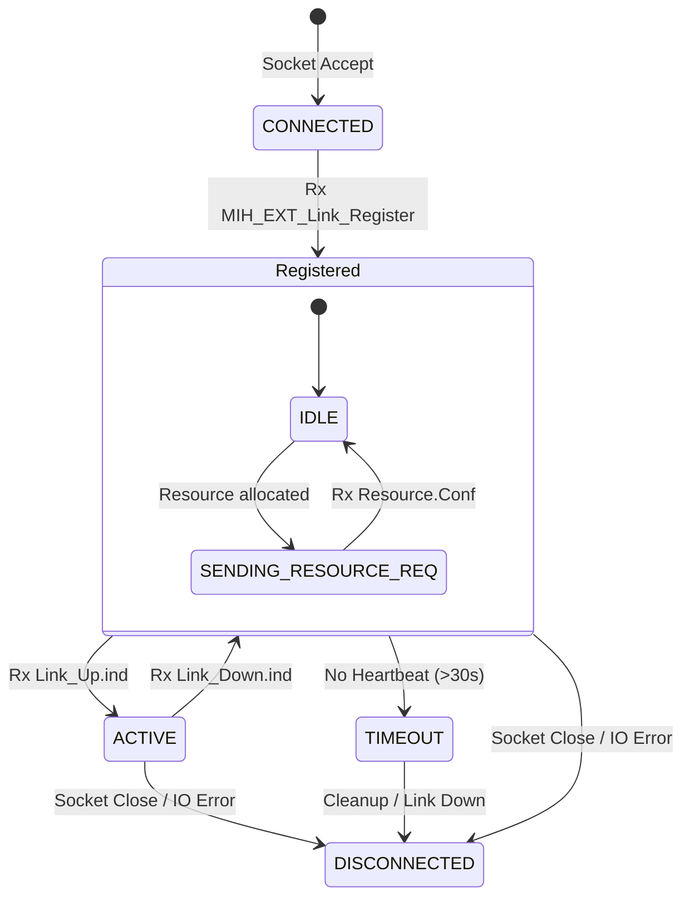

# MAGIC LMI (Link Management Interface) 接口设计说明书 v1.5

## 1. 概述

本设计说明书基于 `freeDiameter/extensions/app_magic` 目录下的实际软件实现编写。LMI 接口是 MAGIC 系统的北向接口，负责连接 Connectivity Manager (CM) Core 与底层 Data Link Modules (DLMs)。

系统目前支持三种并行工作的通信协议，以适应不同类型的 DLM 集成需求。

### 1.1 协议栈概览

| 协议名称 | 传输方式 | 端口/路径 | 特点 | 适用场景 |
|---|---|---|---|---|
| **Standard MIH** | Unix Stream | `/tmp/magic_lmi.sock` | 全功能，符合 ARINC 839 | **生产环境推荐**，支持复杂 QoS 和全量状态 |
| **Prototype Dgram** | Unix Dgram | `/tmp/mihf.sock` | 低开销，无连接 | **嵌入式原型**，资源受限的简单 DLM |
| **Legacy IPC** | UDP | `:1947` (默认) | 仅支持心跳和简单状态 | **旧设备兼容**，或仅需单向状态报告的设备 |

---

## 2. Standard MIH 协议 (推荐)

基于 IEEE 802.21 传输层，使用 TLV (Type-Length-Value) 编码。

### 2.1 消息格式
所有消息以 12 字节定长头部开始，后跟变长负载。

**Header Definition**:
```c
struct mih_transport_header_t {
    uint8_t  version;           // 必须为 0x01
    uint8_t  ack_req;           // bit0: ACK_REQ, bit1: ACK_RSP
    uint16_t primitive_type;    // MIH 原语类型码 (大端序)
    uint16_t message_length;    // Header(12) + Payload 长度 (大端序)
    uint32_t transaction_id;    // 事务 ID (大端序)
    uint16_t timestamp;         // 发送时间戳 (大端序)
} __attribute__((packed));
```

### 2.2 关键原语定义

#### 2.2.1 链路注册 (0x8101)
连接建立后必须发送的首个消息。

**Payload (MIH_EXT_Link_Register_Request)**:
```c
struct {
    // 链路元组 ID (34 bytes)
    struct {
        uint8_t link_type;      // 见 4.1 节
        char    link_addr[32];  // 物理地址
        char    poa_addr[32];   // 接入点地址 (可选)
    } link_identifier;

    // 能力描述 (18 bytes)
    struct {
        uint32_t max_bandwidth_kbps;
        uint32_t typical_latency_ms;
        uint32_t cost_per_mb;
        uint8_t  coverage;       // 0=None, 1=Global, 2=Terrestrial
        uint8_t  security_level; // 1-5
        uint16_t mtu;
    } capabilities;
    
    pid_t    dlm_pid;            // 进程 ID
    uint32_t reserved;
} __attribute__((packed));
```

#### 2.2.2 链路状态上报 (0x0202)
当物理链路上线 (Connected) 时发送。

**Payload (mih_link_up_ind_t)**:
```c
struct {
    LINK_TUPLE_ID link_id;
    struct {
        uint32_t current_bandwidth_kbps;
        uint32_t current_latency_ms;
        int32_t  signal_strength_dbm;
        uint32_t ip_address;     // 网络字节序 IPv4
        uint32_t netmask;        // 网络字节序
        uint8_t  link_state;     // 1=UP
        uint8_t  signal_quality; // 0-100
        uint16_t reserved;
    } link_params;
} __attribute__((packed));
```

#### 2.2.3 资源请求 (0x0301)
CM Core 向 DLM 发送，请求建立 QoS 通道。

**Payload (MIH_Link_Resource_Request)**:
```c
struct {
    MIHF_ID              destination_id;   // 64 bytes string
    LINK_TUPLE_ID        link_identifier;
    RESOURCE_ACTION_TYPE resource_action;  // 0=REQUEST, 1=RELEASE
    bool                 has_bearer_id;
    BEARER_ID            bearer_identifier;// uint8_t
    bool                 has_qos_params;
    struct {
        COS_ID            cos_id;          // uint8_t, 0-7
        uint32_t          fwd_rate;        // kbps
        uint32_t          ret_rate;        // kbps
        uint32_t          min_delay;       // ms
        uint32_t          avg_delay;
        uint32_t          max_delay;
        uint32_t          jitter;
        float             loss_rate;       // 0.0 - 1.0
    } qos_parameters;
} __attribute__((packed));
```

---

## 3. Prototype Dgram 协议

**适用**: 轻量级嵌入式 DLM，不支持多线程或复杂 Socket 管理。

- **通信方式**: UNIX Domain Datagram (`SOCK_DGRAM`)
- **服务端地址**: `/tmp/mihf.sock`
- **消息格式**: `[ Type (2 Bytes) ] + [ Payload Structure ]`
- **Type**: 对应 Primitive Type (如 `0x8101` 为注册)
- **Payload**: 与 Standard MIH 定义的 `Payload` 结构体完全一致 (**无 TLV 封装**)

*注意: 不支持分包，最大消息不能超过 4KB。*

---

## 4. Legacy IPC 协议 (UDP 兼容)

专用于心跳保活和简单状态报告，使用 UDP 广播或单播到端口 `1947`。

### 4.1 消息头
```c
struct IpcHeader {
    uint8_t     type;       // 见 4.2
    uint32_t    length;     // 负载长度 (不含头)
    uint32_t    sequence;   // 序列号
} __attribute__((packed));
```

### 4.2 消息类型 (type)
- `0x01`: MSG_TYPE_REGISTER
- `0x03`: MSG_TYPE_LINK_EVENT
- `0x06`: MSG_TYPE_HEARTBEAT

### 4.3 心跳消息格式
UDP 监听器主要处理此类消息。

**Payload (MsgHeartbeat)**:
```c
struct {
    char        dlm_id[32];     // DLM 唯一标识符, 如 "SATCOM_1"
    bool        is_healthy;     // 1=Good, 0=Bad
    uint64_t    tx_bytes;       // 累计发送字节
    uint64_t    rx_bytes;       // 累计接收字节
} __attribute__((packed));
```

---

## 5. DLM 状态机 (State Machine)

DLM 在 CM Core 侧由 `DlmClient` 结构体维护，其生命周期如下：



- **TIMEOUT**: 心跳监控线程每 10s 检查一次，若 `now - last_heartbeat > 30s` 则强制清理。

---

## 6. 关键枚举与代码表

### 6.1 链路类型 (link_type)
| 值 (Hex) | 类型 | 说明 |
|---|---|---|
| `0x01` | Ethernet | 有线网 |
| `0x02` | 802.11 | Wi-Fi |
| `0x12` | LTE | 4G Cellular |
| `0x20` | Inmarsat | 海事卫星 |
| `0x21` | Iridium | 铱星 |
| `0x30` | VDL2 | 甚高频数据链 Mode 2 |

### 6.2 LMI 状态码 (STATUS)
| 值 | 宏 | 说明 |
|---|---|---|
| 0 | `STATUS_SUCCESS` | 成功 |
| 1 | `STATUS_FAILURE` | 通用失败 |
| 4 | `STATUS_LINK_NOT_AVAILABLE` | 物理链路断开 |

---

## 7. 开发集成指南

### 7.1 快速接入步骤 (Standard MIH)
1.  **建立连接**: 使用 Socket API 连接 `/tmp/magic_lmi.sock`。
2.  **发送注册**: 构造 `MIH_EXT_Link_Register` 消息发送。
    -   Header: type=`0x8101`
    -   Payload: 填充自身能力
3.  **等待心跳**: 启动定时器，每 **1 秒** 发送 `MIH_EXT_Heartbeat` (`0x8F01`)。
4.  **状态驱动**:
    -   监测到网卡 UP -> 发送 `Link_Up` (`0x0202`)。
    -   监测到网卡 DOWN -> 发送 `Link_Down` (`0x0203`)。

### 7.2 调试与排错
-   **日志**: 检查 CM Core 日志，查找 `[app_magic]` 标签。
-   **抓包**: 
    -   Standard: `sudo socat -v UNIX-LISTEN:/tmp/magic_spy,fork UNIX-CONNECT:/tmp/magic_lmi.sock`
    -   UDP: `sudo tcpdump -i lo port 1947 -X`

### 7.3 常见问题
-   **Q: 为什么发送了注册消息没反应？**
    -   A: 检查 `message_length` 字段是否包含头部长度（即 payload + 12）。检查大端序转换。
-   **Q: 为什么 30秒后连接断开？**
    -   A: 心跳超时。必须确保心跳包实际发送成功且格式正确。
