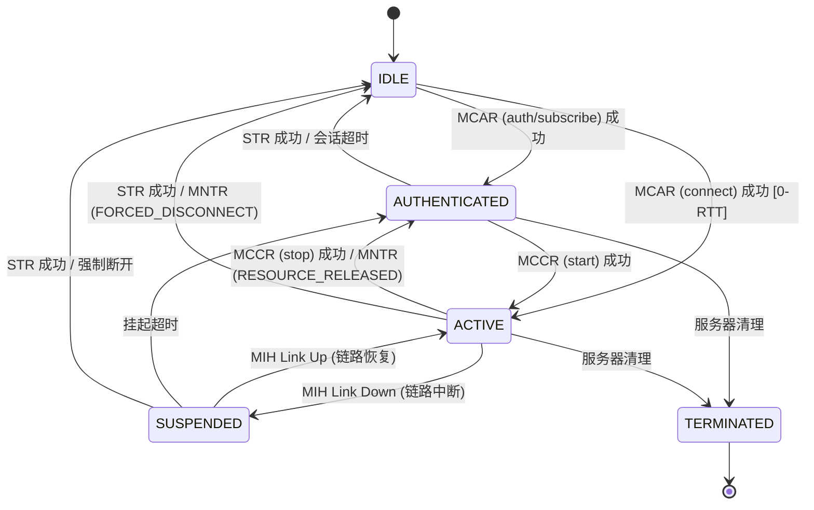

# ARINC 839 MAGIC 会话状态机说明

本文档详细描述了 MAGIC 系统中客户端会话的状态转换逻辑。该设计严格遵循 ARINC 839 标准，并结合了当前系统的实现细节。

---

## 1. 状态定义 (Session States)

系统定义了 5 种核心会话状态，用于跟踪客户端从接入到断开的全生命周期。

| 状态名称 | 枚举值 | 含义 | 数据面行为 |
| :--- | :---: | :--- | :--- |
| **IDLE** | 0 | **空闲状态**：TCP/Diameter 连接已建立，但尚未通过身份认证。 | 🚫 所有业务流量被拦截。 |
| **AUTHENTICATED** | 1 | **已认证状态**：身份验证成功，但尚未申请具体的链路资源。 | 🚫 业务流量拦截，仅允许控制面消息。 |
| **ACTIVE** | 2 | **活动状态**：已成功分配链路资源（IP、带宽、QoS），业务通道已打开。 | ✅ 允许白名单内的业务流量通过。 |
| **SUSPENDED** | 3 | **挂起状态**：由于物理链路中断（如卫星信号丢失），资源被暂时回收，但会话上下文保留。 | 🚫 业务流量暂停，等待链路恢复。 |
| **TERMINATED** | 4 | **终止状态**：会话已结束，资源完全释放，等待清理。 | 🚫 所有流量拦截。 |

---

## 2. 状态转换图 (State Transition Diagram)



---

## 3. 关键转换逻辑详解

### 3.1 接入阶段 (Access)
- **IDLE → AUTHENTICATED**: 客户端发送 `mcar auth`。服务器校验用户名密码，成功后将会话标记为已认证。
- **IDLE → ACTIVE (0-RTT)**: 客户端发送 `mcar connect`。服务器在认证的同时直接分配链路资源，实现快速接入。

### 3.2 资源管理阶段 (Resource Management)
- **AUTHENTICATED → ACTIVE**: 客户端发送 `mccr start`。策略引擎根据当前链路负载分配带宽，数据面（iptables/ipset）打开对应通道。
- **ACTIVE → AUTHENTICATED**: 客户端发送 `mccr stop`。服务器回收带宽和路由规则，但保留客户端的登录状态。

### 3.3 异常与恢复阶段 (Exception & Recovery)
- **ACTIVE → SUSPENDED**: 当 DLM 检测到物理链路断开（如 `ens37 down`），服务器会向客户端发送 `MNTR (LINK_DOWN)`，并将状态转为 SUSPENDED。此时不删除会话，以便链路恢复后快速重连。
- **SUSPENDED → ACTIVE**: 链路恢复后，如果会话未超时，系统可自动或通过 `MCCR` 恢复业务。

### 3.4 退出阶段 (Exit)
- **任意状态 → IDLE/TERMINATED**: 
    - 客户端主动发送 `quit` (STR)。
    - 服务器因长时间无心跳触发 `IdleTimeout`。
    - 管理员通过管理后台强制踢出客户端。

---

## 4. 状态与控制命令对应表

| 命令 (Command) | 初始状态 | 结果状态 (成功) | 说明 |
| :--- | :--- | :--- | :--- |
| **MCAR auth** | IDLE | AUTHENTICATED | 仅登录 |
| **MCAR connect** | IDLE | ACTIVE | 登录并建链 |
| **MCCR start** | AUTHENTICATED | ACTIVE | 申请资源 |
| **MCCR modify** | ACTIVE | ACTIVE | 调整带宽/QoS |
| **MCCR stop** | ACTIVE | AUTHENTICATED | 释放资源 |
| **MSXR** | ANY | 保持不变 | 查询系统状态 |
| **STR** | ANY | IDLE | 退出登录 |

---

## 5. 开发者参考

在代码实现中，状态转换主要分布在以下函数：
- **认证处理**: `magic_cic.c` 中的 `cic_handle_mcar()`
- **资源处理**: `magic_cic.c` 中的 `cic_handle_mccr()`
- **链路事件**: `magic_lmi.c` 中的 `handle_mih_link_down_indication()`
- **超时清理**: `magic_session.c` 中的 `magic_session_cleanup_timeout()`

**状态检查宏**:
```c
if (session->state == SESSION_STATE_ACTIVE) {
    // 允许执行业务操作
}
```
